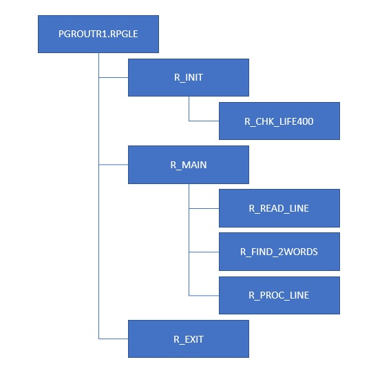

# Export

You can access the export screen

- by selecting `File` menu and then `Export tree as...`
- by pressing F2

The screen displayed is similar to the image:

The parameters you can change are explained below.

- `Exported file name`: any valid windows file name without the extension.
- `Title`: the title will be shown at the top of the file.
- `Max export level`: the routines with a depth level less or equal than this are exported. The root routine has a level of 1, the root's children routines have a level of 2 etc.
- `Output format`: the type of file name created (see [Output formats](#output-formats)).

## Export all vs export only visible

?> If you want to export all the routines press the button `All`

?> If you want to export only the visible routines press the button `What you see`

## Bookmark and export

If you want to export a range of consecutive routines you can bookmark the **first** and the **last** (or the first only) by selecting them and pressing `F11` and then pressing the button `Selected`.

## Output formats

### Web tree with source code

### Vertical web flowchart

### Horizontal web flowchart

### Vertical powerpoint flowchart

### Text tree

### Text tree for AS400

It is the same as plain text but the connectors `├─ └─` are replaced by plain characters `|_ \_`, so the tree can be inserted into the source member without problems.

