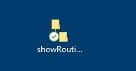

# Installation

Run the program `showRoutines_installer.exe`.

It creates a folder `%appdata%\showPrograms` with the required files.

Also a shortcut is created on desktop.

It is recommended to have Notepad++ installed although it is not mandatory.
