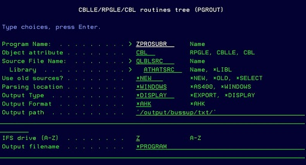
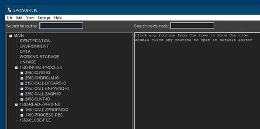

# Using PGROUT

The command **PGROUT** runs in AS400.
A mapped IFS drive is required, for example `Z --> \\gredev\output`.

```
in command line run:
DCOMMON/PGROUT PROGRAM(ZPROSUBR) FILE(ATHATSRC/QLBLSRC)
```



The mandatory parameters are only the program name, type, and source file and library.

Output type :

- \*DISPLAY to show the tree in a window.
- \*EXPORT to export to a web page immediately.

IFS drive (A-Z) : must be the mapped drive.

## Showing the result

If the \*DISPLAY output type is selected the resulting tree is showed in the windows app:


