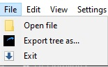
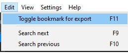
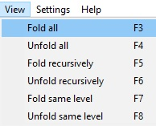
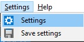

# Using the App

## File menu

Open file is useful when the program source is already downloaded from the AS400 into windows storage.

By selecting a cobol or rpg program source we skip the AS400 command and display immediately the tree.

The `Export as tree...` option opens up a window to select the type of the export (see [Export tree](./export.md)).

## Edit menu

`Toggle bookmark for export` marks the first or last routine for export. One or two bookmarks can be defined.

`Search next` and `Search previous` searches the tree for the routine filled in the input field **Search for routine**.

## View menu

To clear the clutter there is the possibility to fold the unnecessary routines.

By default only the first three levels are displayed at the start.
It can be changed in [Settings](./settings.md).

## Settings menu

`Settings` Opens the settings dialog (see [Settings](./settings.md)).

`Save settings` saves the settings immediately, but it is done also when closing the application.
