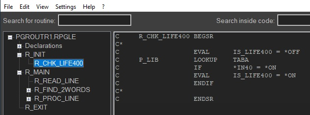
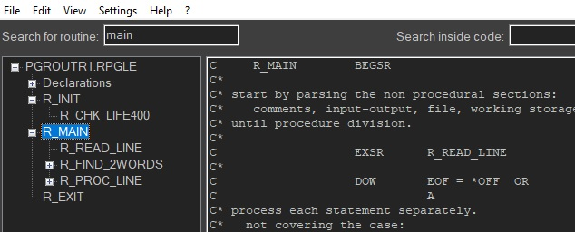

# Using the App

## Code review/search

Select a routine to show the routine's code in the right panel.

Fill a name or part of it in the left search box and press enter to locate the routine. Press enter again to find next occurence.

Source search is rather rudimentary.
To search inside the source fill the search-string in the right search box and press enter.

?>Tip: the better way to search is by exporting to a web page.

## Managing levels

At first 3 levels are shown.

- Press F4 to open all levels.
- Press F3 to close all levels.
